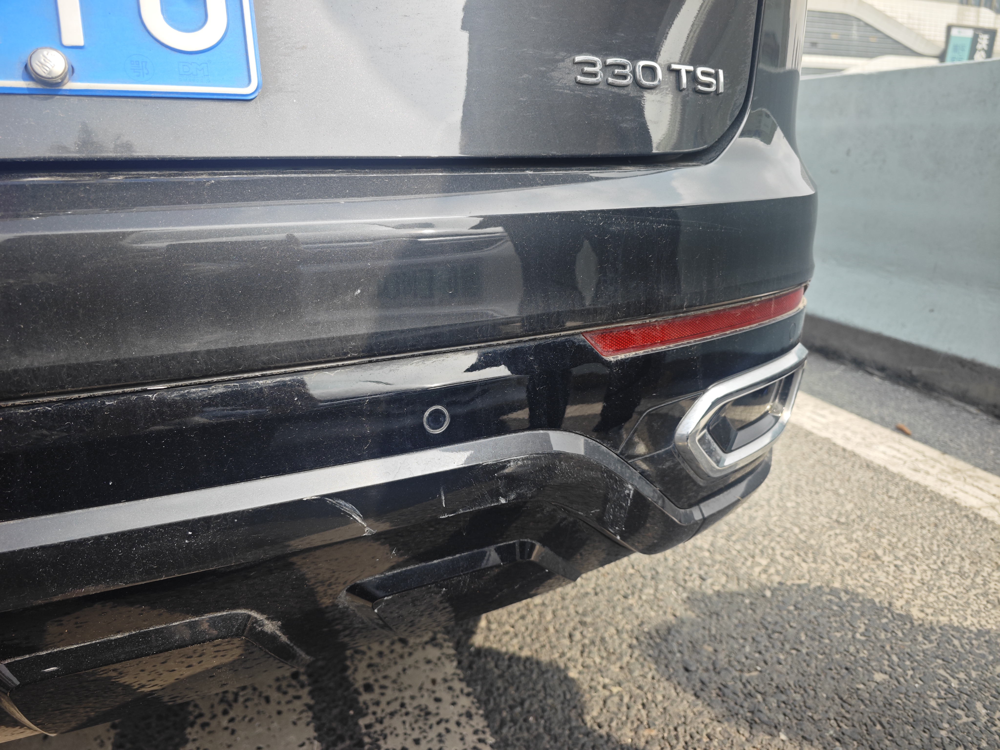

# *2024.1* *LOG* 
## **第一周**

### Mon
 - [x] 配置wrt网络代理
  -  > 实现了透明化代理、可以访问谷歌和Chat-GPT
  -  > 学习、了解了在NAS上安装虚拟机和旁路由的使用配置

### Tue
- [x] 练习SQL-Labs 
 - >  熟悉了整个sql注入的脱库过程
   > 了解了常规的各种注入方式  
 - [x] 学习SQL-MAP工具

### Wed
- [x]  完成SQL-Labs主流
- [x]  完成Pikachu里sql注入

### Thu
  - [x] 配置了Wrt网络 优化了对访问国内、外的速度

 - [x] 完成了Pikachu靶场的练习
-  >  xss 、暴力破解密码

 ###  Fri
 - [x] 了解学习方向、目标制定战略
- [ ] 学习php的序列化
 - >  配置好pastor的“闪退”事件、配置好调试功能
   >  学习PHP序列化到一半
 ###  Sat
 - [x] 制定了具体学习重点和权重
 - [x] 学习反序列化漏洞（重点）
  -  >初步学习完了php反序列化漏洞 photom的网页配置还未配置好
      >还欠缺练习 对于该漏洞还未完全理解
 ###  Sun
 - [x] 学习了Java反序列化漏洞
 - > 感觉很难特别在看代码复现 感觉很多都看不懂
   > 明天再好好研究研究

## **第二周**
### Mon
- [ ] 继续硬刚反序列化漏洞复现
#####  未完成
   > 感觉有点类似与代码审计的工作，而且时间线拉的很长。
   >  且权重没有那么高，了解了个基本以后再完善

- [x] 爆破全部过了一遍
- [ ]  背30个单词
  
  ### Tue
- [x] 学习了解了MSF
 ### Wed
- [x] 继续昨天的练习MSF
- [x] 训练了游泳和力量
 ### Thu
- [x] 学习完成msf核心功能
### Fri
- [x] 全部学习完成了 MSF和CS工具的使用
### 周末
- [x] 游泳训练+游泳

## **第三周**
### Mon
- [x] 调试新手机
### Tue
- [x] 初步学习了解了WPA的调试过程
### Wed
- [x] 初步了解了学习wpa的网络协议
### Thu
- [x] 学习完成WiFi渗透
- [x] 初步学习AWVS
### Fri
- [x] 学习完成AWVS
- [x] 学习二级一小时
### Weekday
 - [x] 完成力量
 - [x] 调试了解switch
 ## **第四周**
### Mon
  > 一直在玩和调试、颓废ing
   >  超频switch和玩不想学 可能和周末的惯性有关

### Tue
- [x] 完成逻辑漏洞实战篇
  
   > 完成了一次完整的vulnhub-prime1漏洞提权练习

 ##### 未完成
- [ ] 必须至少开始学习WPS 一小时  

### Wed
- [x] 完成了 vulnhub靶场实战系列DC9 fhxc#### 未完成

###  Thu
 ##### 未完成
- [ ] 完成WPS二级内容

- [x] 练习vulnhub靶场并复盘
### Fri
- [x] 完成了rap MAC地址的练习

### Weekday

##### 未完成

感觉又是碌碌无为，感觉每次都是循环
只要是周末没有开始学习任务 到了周一就不知道什么原因导致很难开展学习任务
而且马上就要到二月份了 WPS的二级任务还没开始 感觉 .....


# *2024.2* *LOG*
## **第一周**
### Mon
- [x] 完成了日常 程序的调试
  > - cmder 功能全面
  > - 管理鼠标右键方案
  > - 配置小米妙想中心
  > - 重新配置好git、以后使用git写笔记

- [x] 恢复内力 内功

  https://tech.meituan.com/2018/04/16/study-vs-work.html
  
  ### Tue

- [x] 收尾ARP渗透与防御

##### 未完成

- [ ] DDos 失败

  > - 目前找的学习资源太少了 放后面在补学吧
### Wed
- [x] 一直在学习域渗透（内网渗透）
  > - 基本工具的使用 
  > - 关于域和组的相关概率
### Thu
- [x] 域的相关工具的探测和使用
### Fri
##### 调整
``````verilog
最近不知道怎么回事 老是去配置一些和对学习有帮助的 软件、环境或是什么但是
时间话的很长。。。 怎么讲呢就是学习工具上花的时间比我学习本身还长
对于权重上的把握没把握好 现在定两个规矩 
> 每天最少完成四个小时学习的任务
> 每天开始的任务必须是学习的任务一小时
``````
- [x] 学习了具体 内网端口和IP的扫描的工具的使用
- [x] 安装了PDF的编辑工具（感觉还是非常实用的）
- [x] 安装了一个小众的边写编译的软件
### Sat
- [x] 安装了AHK的软件 并优化了很多新的东西 
  > - 感觉还是学到了很多东西的
  > - 认识了解到了AHK这么强悍的东西

- [x]  边写边译安装 auto copy编写

### Sun
##### 摆~~~~~~~~
```
因为没休息好所以 .......
```

## 第二周 
### Mon
###### 未完成: 内网渗透（学习到：内网渗透信息收集查找域内控制器）
```verilog
目前这个属于后渗透阶段，我现在主攻的方向还是渗透阶段
且这方面的学习投入大，对于前期我找工作来讲 权重没有那么大
我现在的主攻方向还是以渗透、渗透实战为主   基于实战 查漏补缺 夯实基础
```
###### 制定新方向、基于实战 查漏补缺 夯实基础
## Tue
##### 完成了DC-1的靶场和笔记
#####  查漏补缺

- nmap的使用

- 信息收集（主机）、CMS指纹识别

- hashcat跑密码

- Linux提权、搭建服务

---
# Hello Friend
好久不见 新年快乐 春节就这么不知不觉的过去了 现在我还有点节后综合症。当然现在我也没时间踹息 得赶紧调整好状态 准备迎接考试

## 2.21 Wed
学习WPS 准备考试 

- [x] 一天至少先保证完成量 4h 之后再追究效率


## 2.26 Mon
- [x] 继续完成WPS的考试任务 每天一套题目
- [x] 完成WPS考试笔记的初步记录

## 2.27 Tue
- [x] 装修我的桌子

- [x] 完成第七套题 梳理笔记

## 2.28 Wed
- [x] 完成了 第四套题的Word

## 2.29 Thu
- [x] 完成第四套全部
- [x] 开始第五套 开始

# Hello Friend
## 11.7
之前转到的芯片领域 然后又是贪玩空闲了好一阵 抱歉，也罢玩乐也是我人生中的一个阶段和必要的组现在重启继续我们的安全之旅吧

# A New Reboot  2026
## 2026.1.23 
不知不觉这个log已经过了两年了，讲真这已经是我无数次感到迷茫与无助了，这是我又一次的抽烟、喝酒彻底堕落。
我不清楚这是不是我二十多年纪应该有的状态 毫不夸张的说我现在已经处于抑郁疯狂的边缘了

### **现实处境**

- 每月固定的债务 财务问题 没有稳固的收入来源
- 完全不知道自己的未来何去何从，没错现在更糟糕的是 我连往哪使劲都不知道
- 完全看不清的职业规划 未来生活规划 ...

但是我现在唯一清楚的一件事就是 我不能再这么下去了: **靠等是没有任何作用的 只有干中想 想再干结合**
所以我给自己提出如下纲领要求自己 **哪怕自己再迷茫、再无助 铁打的纪律每天要完成的事项** 
这些事项可能短期都没办法 看到成效,但长期来看对未来肯定是有益处的 至少比每天什么都不做要强

---
## 模板
#### 纪律
- [ ] work (/500)  ***at least 500/week***
- [ ] log   ***everyday***
- [ ] study  ***not find direction***
- [ ] workout (/4) ***3 times a week sum 1/100***

- 坚持不脱产 每月保证一定收入
- 每天坚持写Log 记录每天都干了什么
- 一星期至少运动3-4次 保证年后找工作的形象状态
- 每天不能一直待在家里，要么图书馆要么劳动
- 不管未来找什么工作，一定要保持学习状态 哪怕就只是学习自己感兴趣的

### 道路是曲折的 前途是光明的


### 1.24 Sat

#### 纪律
- [ ] work (/500)  ***at least 500/week***
- [x] log   ***everyday***
- [ ] study  ***not find direction***
- [x] workout (1/4) **3 times a week sum 1/100**

今天上午因为电脑电池的原因，直到下午一直在折腾电池 说真的我是想把笔记本触控板和电池都换新的，但是 害头疼....
现在要求前一天制定每天的计划 第二天直接围绕计划来行动

### 1.25 Sun

#### 纪律
- [x] Work (160/500)  ***At least 500/Week***
- [x] Log   ***Everyday***
- [ ] Study  ***Not find direction***
- [ ] Workout (/4) **3 times a Week Sum 1/100** 

今天运气还算不错，赚了161。明天再接再厉. 开启新的一周 必须四条纪律全部完成.
刚晚上十点又去买了啤酒和小垃圾零食，我宣布**2026.1.25** 是我最后一次放纵了 
明天必须开始减肥

## New week

### 1.26 Mon
#### 纪律
- [ ] work (/500)  ***at least 500/week***
- [x] log   ***everyday***
- [ ] study  ***not find direction***
- [x] workout (1/4) ***3 times a week sum 2/100***
 
今天没有上班，主要是因为都在给电脑换电池 索性还算顺利一切. 起码算省了50+
今天就当自休息。还有就是要调整作息 每天晚上12点前必须休息 不然影响第二天纪律
我觉得我是时候学点东西了，虽然我现在也不知道我以后的职业发展方向在哪，但我希望我
能充实起来，而不是坐着干等。比如我爱好或坚信未来一定会对自己有帮助的事情: 比如
code 、金融、电气 总有一款适合我。白白等待只会让自己什么都来不及 时间在一点点的流逝

### 1.27 Tue
#### 纪律
- [ ] work (100/500)  ***at least 500/week***
- [x] log   ***everyday***
- [ ] study  ***ZShell***
- [ ] workout (/4) ***3 times a week sum 1/100***
 
这次换了个电池 性价比真高，平均可以使用6h 充满只需一小时，这续航还要什么轻薄本
爽 应该早点换的 早点随时随地大小code

### 1.28 Wed
#### 纪律
- [x] work (100/500)  ***at least 500/week***
- [x] log   ***everyday***
- [ ] study  ***ZShell***
- [ ] workout (1/4) ***3 times a week sum 2/100***

在黄石休息了一天

### 1.29 Thr
#### 纪律
- [ ] work (100/500)  ***at least 500/week***
- [x] log   ***everyday***
- [ ] study  ***ZShell & English***
- [ ] workout (1/4) ***3 times a week sum 2/100***

头大开始要准备论文了，不清楚这个星期的work能不能完成。已经准备想直接找枪手上了。然后我继续
work让专业的人做专业的事。

### 接下里侧重点
二月开始两个侧重点 一：身材管理（体脂控制在20%以内） 二：赚钱 三：学点东西

### 1.30 Fri
#### 纪律
- [x] work (210/500)  ***at least 500/week***
- [x] log   ***everyday***
- [ ] study  ***ZShell & English***
- [ ] workout (1/4) ***3 times a week sum 2/100***

今天下雨送的单送的头大，武汉交通就这B样子，一下雨就堵得爹妈不认
明天不下雨两天最好剩下300块任务完成了。今天回来又刷了半天电脑的视频
和今天工作订单的事情搞得很情绪化和紧张 说好学习Zshell的 又被无关紧要的事情夺走了注意力。
必须要想点什么办法可以及时专注回自己想要做的事
**你坚信什么，什么就有可能成真**

### 1.31 Sat
#### 纪律：无条件、无理由服从 Enforce discipline like a Soldier
- [x] work (320/500)  ***at least 500/week***
- [x] log   ***everyday***
- [ ] study  ***ZShell & English***
- [ ] workout (1/4) ***3 times a week sum 2/100***
- [x] Go to bed at 11 PM, No mobile phones or pad alloweed

本来想说今晚去加个班，凑到100，但感觉实在困得不行了。在晚上加班很容易出事还是算了
感觉这个兼职也越来越没法干了，风险又大收益又低。
还有就是主要是昨晚完全没有休息好，刷小红书和b站刷的脑子空空的 没有什么意义
现在新增一条纪律：每天12点前睡觉 并不能带手机或平板到床上 最多看一下书睡前

### 2.1 Sun
#### 纪律：无条件、无理由服从 Enforce discipline like a Soldier
- [x] work (440/500)  ***at least 500/week***
- [x] log   ***everyday***
- [ ] study  ***ZShell & English***
- [ ] workout (1/4) ***3 times a week sum 2/100***
- [x] Go to bed at 11 PM, No mobile phones or pad alloweed

今天最担心的事还是发生了，在高架上发生追尾。所幸问题不是很大这次，赔了100块
但下次或许没那么好运。这似乎在给我敲一个警钟这行我确实不能长久干下去了。真是讽刺
忙活半天结果什么都是百忙.所以二月应该是我最后一个月把跑车当工作。现在最重要的应该是
加快锻炼和准备好下一份工作。今天开车回到家感觉真的好累好累 这辈子都不想再开车的感觉

 

 

------------------------------------------------------------------
------------------------------------------------------------------

## New Week 

### 2.2 Mon
#### 纪律：无条件、无理由服从 Enforce discipline like a Soldier
- [ ] work (/500)  ***at least 500/week***
- [x] log   ***everyday***
- [ ] study  ***ZShell & English***
- [ ] workout (/4) ***3 times a week sum 2/100***
- [x] Go to bed at 11 PM, No mobile phones or pad alloweed

我想休息两天不想再跑车了，搞得我身心俱疲。感觉跑车就是特别磨人 开了一天车回来什么都不想干了
神经高度紧绷 特别累说实话


### 2.3 Tue
#### 纪律：无条件、无理由服从 Enforce discipline like a Soldier
- [ ] work (/500)  ***at least 500/week***
- [x] log   ***everyday***
- [ ] study  ***ZShell & English***
- [ ] workout (/4) ***3 times a week sum 2/100***
- [x] Go to bed at 11 PM, No mobile phones or pad alloweed

今天本来想说去图书馆的，搞车行李架搞了半天，最后没去成。也罢 真正的强大是需要的越少
不去图书馆也可以让自己保持状态。今天就好好学习放松一天吧.


### 2.4 Wed
#### 纪律：无条件、无理由服从 Enforce discipline like a Soldier
- [ ] work (/500)  ***at least 500/week***
- [x] log   ***everyday***
- [ ] study  ***ZShell & English***
- [ ] workout (/4) ***3 times a week sum 2/100***
- [x] Go to bed at 11 PM, No mobile phones or pad alloweed

今天晚上6点收到 1.31号的的违法处理：闯红灯 也是我该早就意识到这点 每天在城市里穿行
200km 情绪又很焦虑浮躁 迟早出事。似乎上天已经指定我不能再这样浑浑噩噩的干下去这个
再说说我这两天的干的蠢事：两天都在配置lazyvim 真正的活倒没怎么干。也就是真正的本末倒置
每天注意力在无关紧要的事情上，没有真正的专注在自己要要的东西上。但事实上根本没有真正意义上
的完美的配置、最好的工具 这就是一场无止尽的追逐 I say never be complete, I say stop been perfect,
I say let's evolve. Chips fall where they may 这不禁让我想起泰勒的话,真正重要的是 你需要的是什么
你学到什么地方 需要什么再去配置什么，哪怕最后配置不好 没有完美的解决方案。而不是 被奴役去追逐什么完美的
所谓的配置、方案 去配置一些你还没用到的地方或者你根本用不到的地方 ... 
   所以我最后没有去追逐所谓的完美配置，就留了两个插件，尽量保持简单、出厂标准。明天我打算去图书馆 好好静下来看两本书、学会
   zshell 


### 2.5 Thr
#### 纪律：无条件、无理由服从 Enforce discipline like a Soldier
- [ ] Work (/500)  ***at least 500/week***
- [x] Log   ***everyday***
- [x] Study  ***ZShell & English & Quantitative trading***
- [x] Workout (3/4) ***4 times a week sum 2/100***
- [ ] Go to bed at 11 PM, No mobile phones or pad alloweed

昨晚也没睡好，天天遛狗搞的我心累，每天两趟。赶紧过两天送回去。7号还要提交论文的开题报告
今天找我所谓最好兄弟，结果吃了个闭门羹。经过这么多年的相处 很不容易确实也是，距离上次这么长一段友谊走散
还是在小学和那个宋斌凡 那会是没手机 没联系方式后面到搬家走散了。这段确实挺后悔也算被动走散吧, 而这次是我主动
  他其实心里压根就看不上我 没有我的位置，以前两人开玩笑说是表面兄虎、酒肉兄弟，现在来看确实是 至少他心里是这么想的。
如果是我遇到这样的事可能最多考虑半小时就处理了，愿意做一些**HumanSacrfice** 我很清楚就是自己在他那价值不够，没有那么多为什么
和理由，不需要解释那么老费劲，不想自己骗自己。
  我记得好像只有两次求他帮忙 这一次外还有一次是好像在青岛 具体什么事求他我好像也忘了 后面也是不了了之。其实我早就
感觉到了 他老对我开一些不合时宜的玩笑 有时让我很难堪、不尊重我 但我大部分都选择一笑了之 觉得认识这么久了要珍惜
我突然想那句台词 **”Strength is not about having more.but needing less“** 真正的强大不在于拥有多少，而在于需要的更少
没有必要因为沉没成本继续自我意淫自我欺骗对于消耗的关系。写到这我突然有点想让他看看我写的心里话，反正这个log是我每天要完成的
纪律,今天就破个例给别人看一眼 不管他怎么看待 我不予置评。也算坦诚面对这个结束 往后各自精彩


### 2.6 Sat
#### 纪律：无条件、无理由服从 Enforce discipline like a Soldier
- [ ] Work (/500)  ***at least 500/week***
- [ ] Log   ***everyday***
- [ ] Study  ***ZShell & English & Quantitative trading***
- [ ] Workout (3/4) ***4 times a week sum 2/100***
- [ ] Go to bed at 11 PM, No mobile phones or pad alloweed

忘了，今天调皮一下


### 2.7 - 2.14 
#### 纪律：无条件、无理由服从 Enforce discipline like a Soldier
- [x] Work (120/500)  ***at least 500/week***
- [x] Log   ***everyday***
- [ ] Study  ***ZShell & English & Quantitative trading***
- [ ] Workout (3/4) ***4 times a week sum 2/100***
- [ ] Go to bed at 11 PM, No mobile phones or pad alloweed

因为几乎什么没有怎么执行，所以索性就没有。今天又是放纵日了 买了一些零食和酒还有日常的一些食品。主要是过年了
害怕街边的店休息或涨价所以 索性都买一些。害 就当过年了 都喜庆喜庆 过完初三到20号开始就要 真正的对自己严格一点了


### 2.15-16 Sun
#### 纪律：无条件、无理由服从 Enforce discipline like a Soldier
- [x] Work (520/500)  ***at least 500/week***
- [ ] Log   ***everyday***
- [ ] Study  ***ZShell & English & Quantitative trading***
- [ ] Workout (3/4) ***4 times a week sum 2/100***
- [ ] Go to bed at 11 PM, No mobile phones or pad alloweed

今天是我破纪录的日子，也是我最后的绝唱了。马上我就不跑了 也是这行也算是到头了 一天这种巅峰我这车极限也就只能
到370 外加今天杂七杂八最多只能算400 两天。其实和之前一天200数据差不多。 不行我好困 明天再继续写 先睡了
害昨晚又没睡好，贷款的有是东倒西挪


## 2026-7 Week

### 2.17 Tue
#### 纪律：无条件、无理由服从 Enforce discipline like a Soldier
- [x] Workout (1/4) ***4 times a week sum 2/100***
- [x] Work (200/500)  ***at least 500/week***
- [x] Log   ***everyday***
- [x] Go to bed at 11 PM, No mobile phones or pad alloweed
      ~Study  ***ZShell***~

这个算我坑蒙拐骗来的200块吧，哈哈哈只能先往好处想。说真的我感觉又开始学不进去zshell了，因为学这个对我来说本质和玩游戏对比
区别不大 我现在最该努力的应该是未来的职业方向 但你说职业方向在哪我又说不出来。到最后只能说我有一定的天赋在软件上 外加上我
之前投入了很多的时间和精力在这上面所以还是不想轻易的放弃、半途而废。

**洗完澡 我作如下战略部署：暂时废弃zshell 全面精力转向3-4月找工作战略部署准备 提前准备熟悉**


### 2.18 - 2.22
#### 纪律：无条件、无理由服从 Enforce discipline like a Soldier
- [x] Workout (1/4) ***4 times a week sum 2/100***
- [x] Work (350/500)  ***at least 500/week***
- [x] Log   ***everyday***
- [x] Go to bed at 11 PM, No mobile phones or pad alloweed
      ~Study  ***ZShell***~

19号也就是初三去了黄石，到了22才回来期间就来回顺风车赚了150，


------------------------------------------------------------------
------------------------------------------------------------------


